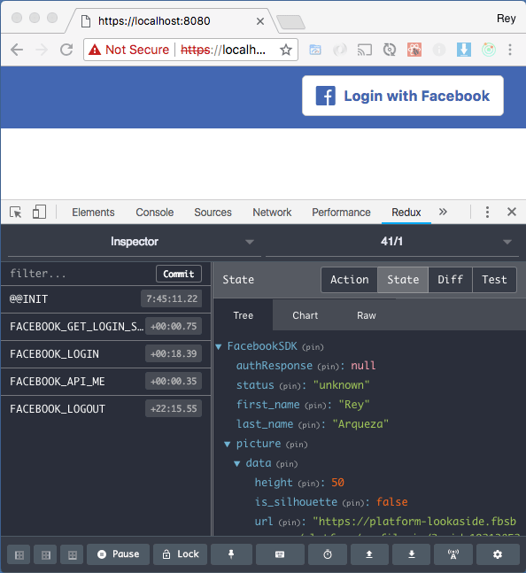

# react-redux-facebook-login-hoc

This component is a react-redux wrapper around the facebook sdk which implements [Facebook Login](https://developers.facebook.com/docs/facebook-login/).

### Demo
To run the demo:

```
npm install
npm start
```

You'll see the following.

#### After Logging In
I'm showing the logged in state first, to demonstrate that in addition to the Facebook Login, I'm also using the Graph API to pull in the user's picture and name. I thought I should show this first because at the time I made this, I couldn't find this feature in other React implementations.


#### Login
As for the loggged out state, this feature is quite common in other React implementations, so I will show this below the fold.




Notice for debugging that I have the chrome plugin support for [Redux DevTools](https://www.npmjs.com/package/redux-devtools).

### Features
You'll find various React implementations on Github for [Facebook Login](https://developers.facebook.com/docs/facebook-login/), and I originally tried a few of those. However, I decided to create my own because I needed these features:

1. The logged in user's picture and name.
1. A logout link.
1. Three presentational components with default styles, which can also be edited for custom branding:
    * Login
    * Loading
    * Logout
1. Easy to re-use by encapsulating the Facebook SDK details, so that a React developer who needed this component didn't need to learn the Facebook SDK.
1. State lives in a single source of truth (redux) instead of the component's internal state.


### Advantages for the designer
The designer doesn't need to understand React. The designer can edit the HTML/CSS of the Presentational Components in the demo folder and basically use the existing webpack build system to preview his/her work. *(See how to start the demo at the beginning of this doc.)*

### The React Developer
The React Developer can then take the edited presentational components and easily pass the presentational components to the HOC (higher order component). See usage below on what to copy/paste into your own source code.

### Usage